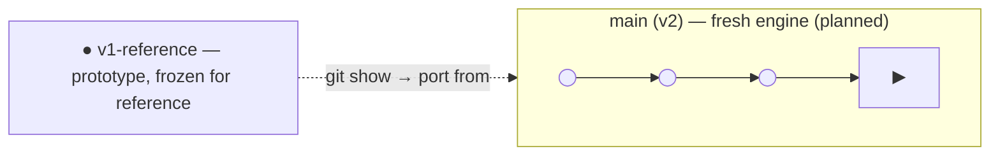

# ADR-004 — Fresh start (v2), with v1 as reference

- **Status:** Accepted
- **Date:** 2026-07
- **Deciders:** Miguel (Lead Engineer), with AI as technical lead
- **Supersedes:** [[ADR-003 — Renderer direction (rendergraph vs rewrite)]]

## Context

The existing codebase grew organically to a working but inconsistent state
(mid render-graph migration, a just-landed resources refactor). Rather than
continue migrating in place, Miguel is starting the engine **fresh, with proper
up-front planning** — while keeping the current code as a **reference prototype
("v1")** to learn from and selectively port.

This is deliberately *not* a blind rewrite: working reference code exists, and v2
is planned before any code is written (see the Foundation Planning sprint). The
discipline is: **port what's proven, redesign what hurt, drop the rest — never
rewrite for its own sake.**

## Decision

1. **v1 = reference only.** No further feature work on the current code. It is
   read, mined for lessons, and ported from — deliberately, piece by piece.
2. **v2 is planned before it is built.** Target architecture and load-bearing
   choices are captured as ADRs first (Foundation Planning sprint).
3. **Git flow — same repo, tag + fresh branch:**
   - Freeze the prototype: `git tag v1-reference` (and keep the `master` history).
   - Start v2 clean and make it the new mainline.
   - Carry the vault (`docs/`) and `CLAUDE.md` forward into v2; freeze v1 code
     behind the tag, reachable whenever we port from it.



4. **Division of labor holds:** Miguel implements v2; AI leads/reviews and writes
   boilerplate on request (see repo-root `CLAUDE.md`).

## Migration steps (Miguel runs these when ready — see the sprint)

> Not executed by AI. There is uncommitted work in the tree today; commit or
> stash intentionally first.

```bash
# 0. Land the current state you want to keep as the reference point
git add -A && git commit -m "Freeze v1 reference prototype"

# 1. Tag the frozen prototype
git tag v1-reference

# 2. Start v2 with a clean slate but keep vault + CLAUDE.md
git switch --orphan v2
git rm -r --cached . >/dev/null 2>&1 || true
# keep: docs/, CLAUDE.md, .claude/, .gitignore, top-level project scaffolding
# remove old engine/runtime source from the v2 working tree as you design it
git add docs CLAUDE.md .claude .gitignore
git commit -m "v2: foundation — vault + AI operating model"

# 3. Make v2 the default branch (locally, and on the remote when there is one)
# porting from v1:  git show v1-reference:path/to/file  > new/path
```

## Consequences

**Positive**
- Clean architecture and history for v2; no legacy baggage in the working tree.
- The prototype's hard-won working code stays one `git show` away for porting.
- Planning-first reduces the classic "fresh start that never ships" risk.

**Negative / risks**
- A fresh start can stall — mitigated by the Foundation Planning sprint, a
  salvage list, and shipping a buildable vertical slice early.
- Porting by hand is slower than migrating in place — accepted, for a clean base.

## Alternatives considered

- **Continue in-place migration** — rejected: perpetuates inconsistency; the
  point is a clean, planned foundation.
- **Brand-new repo** — rejected: would split the vault from the reference code.
- **Restructure in place (reference/ folder)** — rejected: mixes v1 + v2 in one
  working tree.
