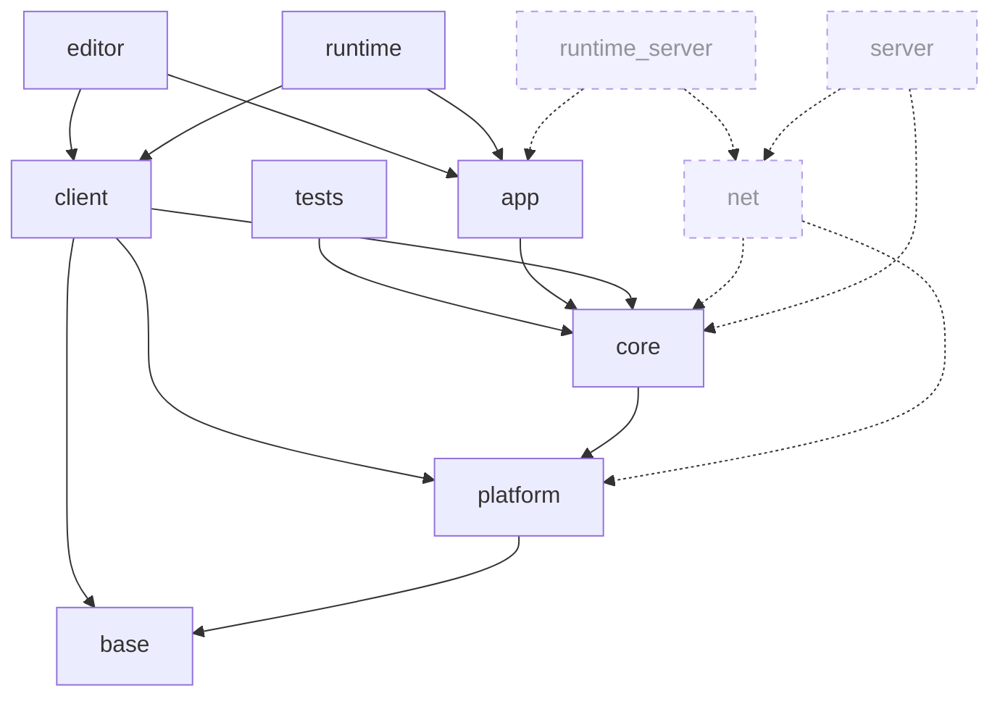

# ADR-006 — v2 core architecture & module layout

- **Status:** Accepted
- **Date:** 2026-07
- **Deciders:** Miguel (Lead Engineer), with AI as technical lead
- **Related:** [[ADR-004 — Fresh start (v2) with v1 as reference]] ·
  [[ADR-005 — v2 tech stack & toolchain]] · **pairs with B1b** (Networking & ECS
  replication foundation ADR) · feeds **B2** (renderer), **B3** (build+testing),
  **B4** (code conventions)
- **Task:** B1 — the structural skeleton. Deep subsystems get their own ADRs (below).

## Context

ADR-005 fixed the *stack*; this fixes the *shape*. Before any subsystem is designed
(B2) or scaffolded (B3), v2 needs its module graph, API-boundary mechanism,
composition/wiring model, and the System/helper taxonomy — the decisions everything
else hangs off and that are expensive to reverse once code exists.

The v1 audit is a catalogue of **boundaries that were promises, not compiler-checked
facts**: `src/` exported to every consumer (F3), core `#include`ing editor source
(F12), a runtime service-locator every system reached into (F5), "everything is a
System" inflating a serial loop (F16/F19), the scripting SDK leaking private types
(F11), the editor welded into the render loop (F14). This ADR makes the boundaries
structural.

**Multiplayer is planned now.** TechEngine is a *client/server* engine (CLAUDE.md);
authority + replication cannot be bolted on later without rewriting every gameplay
system and the entity model. So the *foundation* for client/server is decided here,
even though the *wire* is implemented later. The line: this ADR decides module
seams + composition modes; the authority/replication **architecture** is B1b
(ADR-007, its immediate pair); the transport + protocol **implementation** is
deferred behind those seams.

**B1 decides:** module/target graph + linkage, client/server composition modes, API
boundary, composition/wiring, System/helper taxonomy (incl. logging+assert).
**B1 defers** (own ADRs): **B1b — authority model, input-as-command, replicated/
snapshot-able ECS, network-stable identity (F1)**; job-system & task-graph/scheduler
(F15); event-system redesign (F28); scripting SDK & hot-reload (F9/F11); netcode
transport + protocol; binary asset/scene serialization.

## Decision

### 1. Module / target graph — 5 static libs + leaf exes

Strict **acyclic downward** DAG. Everything static, linked once per exe → one set of
globals (ADR-005; kills F4 and the F1 counter-collision that rode on it). **No engine
DLLs** (the only future DLL is the user game/scripts module — scripting ADR).

| Lib | Role | Contents | → depends on | 3rd-party |
|-----|------|----------|--------------|-----------|
| **base** | pure foundation (below the OS) | math, logging, assert, clock-abstraction, small containers/allocators — **no OS, no ECS** | — | glm, spdlog |
| **platform** | the OS seam | window, input, file I/O, hi-res timer, dynamic-lib load, sockets *(later)* | base | GLFW, glad2 |
| **core** | **simulation (server-capable)** | ECS, events, resources (CPU/UUID), serialization, **physics (Jolt)**, job-system | base, platform | Jolt, toml++ |
| **client** | **presentation (client-side)** — rendering + window + input + audio (rendering is a subsystem, not the whole lib, hence not "renderer") | GL 4.5 device seam, render graph+passes, window binding, input, **GPU resource upload**, audio playback | core, platform, base | miniaudio |
| **app** | loop + composition root | game loop (simulate \| present), engine lifecycle; presentation-agnostic | core | — |

**Executables** (leaves — nothing links them; `main()` is ~10 lines, the loop lives in `app`):

| Exe                                       | Composition                                                                | Role                                                                                          |                              |
| ----------------------------------------- | -------------------------------------------------------------------------- | --------------------------------------------------------------------------------------------- | ---------------------------- |
| **runtime**                               | app + client + core                                                        | shipped standalone; a **client**, and a **listen-server** when it also runs authoritative sim |                              |
| **runtime-server** *(when netcode lands)* | app + core (+ net)                                                         | **dedicated server** — no client/GLFW, headless                                               |                              |
| **editor**                                | app + client + core + tooling; **owns the asset pipeline** (import + bake) | host/observer of `app`, out of the frame loop                                                 | ImGui, ImGuizmo, assimp, stb |
| **tests**                                 | per-module Catch2 targets under CTest                                      | deterministic tests across modules (not core-only)                                            |                              |


(`client` = presentation: rendering + window + input + audio. A `runtime` exe links
it; a `runtime-server` deliberately does not. `net`/`server` are reserved future
modules — see §2.)

Rationale for the seams:
- **base vs core** sit on opposite sides of `platform`. `platform` needs base's
  logging/math but must never know the ECS; if logging lived in `core`, then
  `platform → core` **and** `core → platform` = a cycle. `base` breaks it. You need
  base-without-core constantly (platform, client-math, tools); never core-without-
  base. So they cannot merge.
- **client separate from core** is the client/server seam: a simulation that
  *cannot* `#include` the client is what makes a **headless server** possible. GPU
  upload + audio playback live here (client-only); their ECS components live in `core`
  (server-side). Mirrors v1's CPU/GPU resource split, kept (F23).
- **physics stays in core** — it's authoritative simulation the server runs.
- **client not split** — rendering (`device/ graph/ passes/`), window, input, audio are
  folders inside `client`; promote an `rhi` module only when a 2nd render backend is
  real (same trigger as ADR-005's seam).
- **asset pipeline is editor-owned** — the **editor imports** source assets (FBX/PNG →
  via assimp/stb) **and bakes** them into the engine's binary format; `runtime`/`core`
  consume **only baked binary** (no importers, no assimp at runtime). So assimp/stb are
  **editor** deps; the baked binary format is shared (written by editor, read by
  runtime) and belongs to the binary-serialization ADR. This keeps the shipped runtime
  and the dedicated server lean and importer-free.

### 2. Client/server & the multiplayer foundation

Client and server are **compositions of shared libraries**, not separate stub
libraries (v1's F2/F34 mistake — a Server lib that forwarded to Core and did nothing).
The seam is *does this code touch the GPU/window* (presentation) *or not* (simulation):

- **dedicated client** = `app + client + core`
- **dedicated server** = `app + core` (+ `net`) — no client, headless
- **listen-server (player is host)** = the `runtime` client also running authoritative sim

**Where server code goes** (decided now; implemented in B1b + later):
- **Authoritative simulation** (movement rules, physics) → normal Systems in `core`;
  shared, run authoritatively on the server and predictively on the client.
- **Replication / state sync** (e.g. syncing transforms on player move) → Systems in a
  future **`net`** module (→ core, platform — *never* client), running in mirror
  roles: server encodes+sends, client receives+applies. Not a separate program's code.
- **Role-specific logic** (session/connection mgmt, authority arbitration, validation,
  authoritative spawn) → a future thin **`server`** module (or role-gated `net`
  systems) — *genuine* logic, not v1's forwarding stub.

**Foundational constraints locked now** (so multiplayer isn't a retrofit; detail →
B1b): server-authoritative model; **input flows as command/intent data**, consumed by
authoritative systems (not direct mutation); **fixed-timestep** authoritative tick;
the **ECS is designed replication-ready** — replicated-vs-presentation component
distinction, dirty-tracking, snapshot-able world, and **network-stable entity/
component identity** (the F1 fix, required not optional). `app`'s loop exposes a
**headless/sim-only mode** (already exercised by `tests`), so `runtime-server` needs
no reshape.

### 3. API-boundary model — two tiers, enforced physically

**Tier 1 — module ↔ module:** per module `include/TechEngine/<module>/` **PUBLIC**,
`src/` **PRIVATE** (`target_include_directories(te_<m> PUBLIC include PRIVATE src)`).
A consumer sees only `include/` → a private include **cannot resolve → hard compile
error** (kills F3; makes F12's inversion unwriteable). Link deps carry visibility
(PUBLIC if used in public headers, else PRIVATE) — the target graph *is* the boundary.
**No export macros** (`CORE_DLL`) — dead weight under static linkage. Rule: a module's
public header must not expose a lower module's private type (forward-declare/handle/
pimpl at boundaries).

**Tier 2 — script SDK:** a curated `INTERFACE` target (`te_sdk`) over a hand-picked
`sdk/include/` tree — **not** the module `include/` dirs (v1's fatal F11 assumption).
Exposes only **façade** types whose full definitions ship (a `ScriptContext` façade,
never a raw `ResourceSystem*`). **PIMPL/abstract-interface + symbol visibility only at
this one game-DLL seam** (scripting ADR) — never engine-internal.

**Fail-fast enforcement:** private headers physically unreachable; clang-tidy
`misc-include-cleaner`/IWYU (ADR-005 CI); **★ a CI "SDK smoke" target** compiling a
sample script against `te_sdk` *alone* — any private type leaking into the SDK fails
CI. The F11 acid test, automated.

### 4. Composition & wiring — explicit DI + one immutable context, root in `app`

Replace the F5 service locator. **Hybrid:** explicit constructor injection is the
rule; a small **immutable, non-owning `EngineContext`** carries the few engine-wide
services. Reject a DI framework (re-hides deps — another F5) and a fat god-struct (a
locator with nicer syntax).

```cpp
// core — engine-wide SERVICES only (non-owning refs, engine-lifetime). NO device here:
// presentation (GPU device) is owned by the renderer System, not a shared service.
struct EngineContext {
    JobSystem&        jobs;    const Clock&      clock;   FrameAllocator& frameAlloc;
    IFileSystem&      fs;      ResourceRegistry& resources;   EventBus& events;
};
struct FrameContext { float dt; float fixedDt; uint64_t frameIndex; const EngineContext& engine; };
```

- A system's **constructor signature is its dependency manifest** — greppable,
  compile-checked; no `getSystem<T>()` runtime throw (F5). Systems store the refs they
  use, not the whole context.
- **`EngineContext` guardrails:** immutable `const&`, typed named fields (not a
  `type_index` map), small + curated, **holds no systems** — only foundational
  services. A system reaching a *sibling system* through it is the regression to reject.
- **Ownership (F13):** the composition root owns services + systems **by value**;
  systems hold non-owning `&`/`const&`/handles — never `shared_ptr`.
- **Composition root lives in `app`** — one per exe (runtime/editor/tests wire the same
  modules differently, which is what makes client/server/headless compositions and
  editor-out-of-loop structural). Lower modules never reach up → fixes F12. It stays a
  short, linear function (no magic resolver).

### 5. System / helper taxonomy — two buckets

**One test — a *System* qualifies on all three axes:** (1) ticks per-frame/fixed,
(2) operates on world/ECS state, (3) ordering is load-bearing. Everything else is a
**helper**.

- **System** — a **registerable unit scheduled in the task graph** at a phase.
  *May own state + lifecycle* (the renderer owns the GPU device + render graph; physics
  owns the Jolt world — owning resources does **not** disqualify it). **Declares its
  component read/write access** (for scheduling + future parallelism). **Engine- and
  user-authored are the same kind**, and engine systems are **defaults that can be
  disabled/replaced** — e.g. the **renderer is a System at the final phase; a user can
  deactivate the engine's and register their own**. The schedule is *data* (add/remove/
  reorder/toggle), not a hardcoded register-list (v1 `Core.cpp:13-33`).
- **Helper** — not scheduled; called on demand. **Utility** (stateless/global: Logger,
  assert, math, clock) = free functions/macros; **service** (stateful, lifecycle:
  FileSystem) = owned + **injected** via `EngineContext`, never globally located.

The "facility" bucket is **dissolved** — Renderer/Physics/Audio are stateful *Systems*,
not a third category. This still kills F16 (Logger/Timer/FS are helpers, not Systems)
and F19 (profiler wraps the scheduler; `string_view` names; no `shared_ptr` registry),
because those were about *helpers-as-systems* and *registry mechanics* — not stateful
systems.

| v1 piece | v2 | Form / access |
|----------|----|----|
| Logger, assert, math, clock | helper (utility) | global macros/free fns; safe under static linkage (F4 gone) |
| Profiler | helper (service) | RAII scopes wrap the scheduler (not bolted in — fixes F19) |
| FileSystem | helper (service) | `IFileSystem` impl in **platform/core** (fixes F30); injected |
| Renderer | **System** (final phase, client-side) | owns GPU device+graph; engine default, user-replaceable |
| Physics | **System** (fixed phase, core/server) | owns Jolt world; authoritative |
| Audio playback | **System** (client-side) | owns miniaudio; components live in core |
| movement, camera, animation, culling, replication | **System** | scheduled stages; engine or user |

**System interface deferred.** B1 commits the *principle* (registerable, stateful-
capable, declares access, {phase, enabled} metadata, engine==user, replaceable). The
exact shape (stateful object vs. function-over-resources vs. concept) lands in the
scheduler/task-graph ADR, entangled with B1b — but given the requirements above it
leans to a stateful object with declared access, **not** a bare function pointer.

### 6. Logging & assert (the F20/F10 fix, as helpers in `base`)

- **Logging:** wrap spdlog; macros capture `std::source_location::current()` (C++20) →
  file/function/line free (fixes F20); every macro `do{…}while(0)` (fixes F10's
  if/else break); math formatters live with math, not the logger; Logger is a
  dependency-free leaf.
- **Assert, two-tier, one handler:** `TE_ASSERT(cond,msg)` debug-only, compiled out in
  release (zero hot-path cost); `TE_CHECK/TE_VERIFY` always-on for shipped invariants →
  log + controlled abort, **never a silent `__debugbreak()` in release** (fixes F10).
  Failure path `[[unlikely]]`/cold.

## Consequences

**Positive**
- F3, F4, F12, F14 die *structurally* (link/compile errors); F5/F16/F19 die by
  construction; F20/F10/F30 fixed; F8 fixed (headless runtime + sample projects).
- **Client/server is first-class**: dedicated client, dedicated server, and
  listen-server are compositions of one codebase; the `net`/`server` seams and the
  replication-ready ECS mean multiplayer is a *foundation*, not a retrofit — with no
  stub polluting the engine now.
- User systems are first-class in the same task graph as engine systems, and engine
  systems (incl. renderer) are replaceable defaults.
- `EngineContext` holds only shared services (device dropped out) — the presentation/
  simulation line is enforced at the wiring level too.

**Negative / open**
- 5 libs + a client/server story is more up-front structure than a monolith —
  mitigated by one shared `techengine_module()` CMake helper + presets; still far less
  pain than v1's globbed/triplicated setup (F6/F26).
- Designing the ECS **replication-ready from day one** (B1b) is real work before
  gameplay code — but that's the point: it can't be added later without rewrites.
- Per-module public/private header curation is up-front work — mandatory for the SDK
  regardless (F11).
- `EngineContext` bloating back toward a locator is the live failure mode — policed by
  §4 guardrails in review.
- Over-tight public surfaces while systems are molten → friction; err slightly wide
  early, tighten as they stabilize.

## Alternatives considered

- **Facility as a third bucket** (Renderer/Physics/Audio not Systems) — rejected: they
  pass the System test; owning state ≠ not-a-system; and a separate bucket blocks
  user-replaceable render/sim systems in the task graph.
- **Option A — one `engine` lib + folders + discipline** — rejected: can't enforce the
  DAG; v1 *had* folders and still produced F3/F5/F12. Discipline is what the audit
  proves fails at scale.
- **Keep a client/server DLL split (v1)** — rejected (ADR-005): F4 duplicated globals +
  the cross-DLL log-sink workaround prove the pain; static-everything removes the bug
  class. Only the runtime-loaded game DLL earns a boundary.
- **Merge `base` into `core`** — rejected: creates a `platform ↔ core` cycle and drags
  the ECS into everything that just wants math/logging.
- **DI framework** — rejected: re-hides dependencies (another F5), fights F13 ownership.
- **Universal `System` base + `type_index` registry (v1)** — rejected: inflates a
  serial loop (F16/F19) and blocks task-graph parallelism.
- **A stub `server` module now** — rejected: v1's F2/F34; build the seam, not the stub.

## What would move this decision

- **Split `core`** into an `integration` module on *measured* build/link regression
  from Jolt weight (pre-authorized; not now).
- **Promote `rhi`** when a Vulkan/D3D backend is real (ADR-005's trigger).
- **`net`/`server` land** as real modules when B1b + transport are done — the slots and
  their dependency edges are reserved so this needs no reshape.

> Add to [[ADR Index]]. Once Accepted, treat as immutable — supersede with a new ADR.
