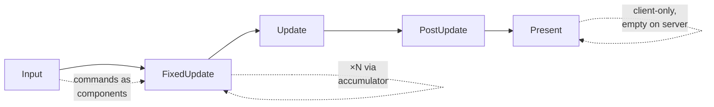

# ADR-007 — v2 networking & ECS replication foundation

- **Status:** Accepted
- **Date:** 2026-07
- **Deciders:** Miguel (Lead Engineer), with AI as technical lead
- **Related:** pairs with [[ADR-006 — v2 core architecture & module layout]] (esp. §2
  client/server, §4 wiring, §5 System/helper) · builds on
  [[ADR-005 — v2 tech stack & toolchain]] · feeds the deferred **job-system/task-graph**,
  **netcode transport**, and **binary serialization** ADRs
- **Task:** B1b — the ECS + multiplayer foundation gameplay code depends on.

## Context

ADR-006 reserved the *seams* for client/server; this decides the *foundation* that
must be true **before gameplay systems are written**, because authority + replication
cannot be bolted on later without rewriting every system and the entity model.

Grounding from the v1 audit: the **archetype ECS model is blessed** (already value-based
SoA — F13's `shared_ptr` churn was in Resources, not the ECS). What must change is
**identity** (v1 IDs came from a reset-able static counter — F1 — and serialization
rode on them) and **iteration/threading** (raw-thread-per-call — F15). This ADR fixes
identity, makes the ECS replication-ready, and defines the authority/command/tick model
+ the System interface (deferred here from B1).

**B1b decides:** entity/component identity, ECS replication hooks, replication strategy,
authority/ownership + command flow, tick/time, and the System interface + scheduling
(parallelism from declared access). **Defers** (own ADRs): the **job-system thread-pool**
(F15 — this ADR designs the interface + task graph it will execute); **netcode transport
+ wire protocol** (ENet/GNS, bit-packing, interest management, lag comp); **binary
serialization format** (shares the registration seam here). Client prediction/
reconciliation *algorithms* are reserved hooks, not designed here.

**Confirmed forks (Miguel, this session):** snapshot+interpolation (not rollback);
POD-only replicated components; coarse declared-writes dirty-tracking (upgradeable);
predicted client-spawns deferred. Tick 60 Hz (config); phase set as below.

## Decision

### 1. Identity — three id spaces, none forced to serve all roles

The load-bearing idea (the F1 cure): **make identity a function of type/content, not of
runtime registration order.** F1 happened because the id was position-in-allocation-order,
which was resettable and consumer-dependent.

**Entity:**

| Boundary | Scheme |
|----------|--------|
| **In memory** | **Generational-index slotmap**: `Entity { u32 index; u32 generation; }` (64-bit, by value). Array-indexed (no hashing on the hot path); destroy bumps generation + frees the slot → stale-handle use-after-free is structurally impossible. Entity-reference fields store this handle. |
| **Serialized (disk)** | Per-scene **authoring-id** + remap-on-load (runtime index never hits disk). **UUID only** for genuinely cross-document entities (prefab roots, persistent objects) — an opt-in component, not a per-entity tax. |
| **Wire** | **Server-assigned `NetId`** (generational `u32`), on **replicated** entities only. Per-connection `NetId ↔ local Entity` table; the local index is never transmitted. Generation defeats the delayed-packet respawn (ABA) bug. |

**Component type** — two ids, bridged at registration:
- **`ComponentTypeId` = 64-bit hash of an author-declared stable tag** (`TE_COMPONENT("TechEngine.Transform")`). Pure function of the type → client and server agree with **zero shared runtime state**. This is what **disk + wire** carry. Rejected: unresettable ordered counter (still order-dependent — a milder F1), and compiler-typename-hash (MSVC≠Clang — breaks the Linux server + CI leg).
- **`ComponentDenseId` = `u16`**, assigned locally by one process-global **`ComponentRegistry`** for archetype masks + System access-sets. Process-local, never serialized/wired. `hash ↔ dense` maps bridge them.
- **Registration:** one static-linked registry (ADR-006: no engine DLLs → no F4 duplication → no F1 cross-DLL collision), owned by the `app` composition root. Engine built-ins register first, game DLL on load; **content-derived ids mean registration order never perturbs any id** — the structural cure for v1's "hand-prime the built-ins" hack (`Editor.cpp:87-94`). Namespaced tags + a registration-time collision `TE_CHECK` make engine↔custom collisions impossible. A **connect-time handshake** exchanges the registered stable-id set so version skew surfaces as a clean error, and negotiates a compact per-session type table (small int per component on the wire).

### 2. ECS data model & replication hooks

Keep v1's archetype + transition-edge model; per-archetype per-component `std::vector<T>`
SoA columns behind `IComponentStorage`; queries iterate matching archetypes as
`std::span<T>` in a tight loop. Two additions:

- **One registration seam carries three facts per component:** stable-id, on-disk-
  serializable, **on-wire-replicated** (ADR-005's reserved trait/registration seam —
  replication *reuses* it, doesn't fork it).
- **Replicated = compile-time trait, POD-only.** `IsReplicated<T>` opts a component in;
  only trait'd columns are ever visited by replication (presentation components — render
  caches, GPU handles, interp buffers — physically cannot cross the wire). **Replicated
  components are trivially-copyable** (no pointers/handles — F13) → the encoder bulk-
  `memcpy`s a whole column from the archetype into the packet. This is the sim/
  presentation split (ADR-006 §2) pushed to the *component* level; the trait is the line.
- **Change-tracking = declared writes → per-column `changeTick`.** When a write-declaring
  System (§6) runs over archetype A touching component C, stamp `changeTick[A,C] =
  tick`. One stamp per (system, archetype, component) per tick — **nothing on the inner
  loop**. Coarse (over-sends on no-op writes); the "changed since tick N" query is
  representation-independent, so a hot column can upgrade to per-instance versioning later
  with no API break.
- **Snapshot: full first, delta as a diff over it.** Full snapshot (every replicated
  component of every replicated entity) for join/respawn; delta encoder emits only columns
  with `changeTick > lastAckedTick` **plus structural ops** (spawn/despawn/add/remove).
  Encode directly from columns into the wire buffer via ADR-006's `FrameAllocator` — no
  per-tick heap snapshot struct.

### 3. Replication strategy — snapshot + interpolation

**Snapshot replication with client-side interpolation** is the v2 default; **delta
compression (§2) is its bandwidth form, not a rival**; discrete gameplay events ride an
**RPC/event channel on top** (never continuous state).

- **Server-authoritative by construction** (matches ADR-006's locked authority); the
  client displays authoritative snapshots.
- **Loss-tolerant & self-correcting** — a dropped snapshot just extends interpolation; the
  next corrects. **No determinism requirement** — the decisive reason to **reject
  lockstep**: bit-exact cross-machine sim over MSVC floats + **Jolt (not cross-platform
  deterministic)** is brutal and forfeit the moment you want a Linux `runtime-server`.
- **Client (architecture; algorithms → netcode ADR):**
  - *Remote entities* → **interpolation buffer** (~100 ms ring), rendered at `now −
    interpDelay`, interpolating between the two bracketing snapshots. Lives in `client`,
    consuming `core` replicated components (ADR-006 sim/presentation line).
  - *Controlled entity* → **prediction/reconciliation hook** (not prediction-first): three
    reserved seams — tick-stamped commands held until acked; snapshots carry tick +
    per-connection `lastProcessedCmd`; predicted replicated components are overwrite-and-
    replayable (POD makes this clean).

### 4. Authority, ownership & command flow

- **Authority ≠ control.** Authority (who computes truth) = **the server, every replicated
  entity, always** — no client authority transfer. Control = a per-entity **`NetOwner =
  connectionId`** (whose command stream drives that entity's sim; `None` = server-driven).
  The UE autonomous/simulated-proxy split.
- **The guarantee is at the replication seam, not the write seam.** Clients *do* write
  replicated components locally — that's prediction. What's forbidden is that ever becoming
  truth: **upstream carries commands only** (no code path serializes client state to the
  server), **downstream carries authoritative state only** (`net → core, platform`, never
  `client`). A client physically cannot transmit truth.
- **Two write tiers of systems** (⇒ scheduler must support **role-conditioned schedules**):
  predicted-shared (in `core`, run on server *and* client — movement, physics) vs
  server-only authoritative (`net`/`server` role-gated — damage, spawn, validation).
- **Command = intent, never result:** `moveAxis` + **absolute** `viewAngles` + `buttons`
  bitmask + discrete parameterized actions. The **same commands** feed the server tick and
  client prediction (identical `core` movement System). **Reconcile by rewind+replay** of
  unacked commands; **ack piggybacked on the snapshot** (`lastProcessedCmd`). Per-
  connection `CommandBuffer` is the jitter buffer; outbound packets carry a redundant
  window of last-N for loss tolerance.
- **Authoritative spawn/despawn only** (server assigns `NetId`; clients materialize a local
  proxy). **Predicted client-spawns deferred** — reserve a predicted-id→server-id remap
  seam (identity §1); server-spawned projectiles interpolate in.
- **Listen-server = authority + one loopback connection.** Host input → a `LocalConnection`
  `CommandBuffer` in-process → authoritative tick. Prediction is the identity function,
  reconciliation a no-op → **zero special-case sim code**; only presentation differs.

### 5. Tick & time

- **Fixed-timestep authoritative sim, accumulator** — default **60 Hz** (`kFixedDt`,
  configurable). The `while (acc >= kFixedDt)` body **is ADR-006's fixed phase**
  (physics/movement/authoritative gameplay); the once-per-frame tail is the **variable/
  present phase** (camera, anim, cull, render) using `alpha = acc/kFixedDt`. Clamp frame
  dt to avoid the spiral of death. Dedicated server runs the fixed loop only (headless).
- `FrameContext` gains `{ tick, alpha, role }` on top of ADR-006's
  `{ dt, fixedDt, frameIndex, const EngineContext& }`.
- **Two interpolations, distinct:** controlled pawn → predicted, smoothed by `alpha` near
  present; remote entities → interpolated ~100 ms in the past.
- **Time sync:** server tick is the master clock. Client runs its prediction tick **ahead**
  by ≈`RTT/2 + jitter` (input lands just before the server ticks it) and its interpolation
  view **behind** by `interpDelay`; the offset auto-tunes via server over/underflow
  feedback (mild time dilation). Listen-server: client tick == server tick (offset 0).

### 6. System interface & scheduling

- **`ISystem` = a stateful object behind a light virtual base** — `update(World&, const
  FrameContext&)`, a cached `access()`, `string_view name()`. One virtual call per system
  per tick (acceptable). Concept-checked at registration for good errors; stateful so a
  system owns its resources (renderer owns the device; physics owns the Jolt world — ADR-
  006 §5). Chosen over Bevy-style function-params because the schedule is runtime data and
  the access set has four runtime consumers (scheduler, replication, game-DLL, tooling).
- **Declared access = runtime `SystemAccess`** (component + resource read/write sets),
  authored via a type-list helper `DeclareAccess<Write<RigidBody>, Read<Collider>…>`,
  lowered to **`ComponentDenseId` bitmasks** at registration. **Debug-validated:** `World`
  asserts `actual ⊆ declared` (touch/write of an undeclared component fires `TE_ASSERT`),
  compiled out in release (F19-safe).
- **Phases** — fixed ordered pipeline, hard barrier between; a system is in exactly one:

  `Input` = raw input → command/intent components. `FixedUpdate(×N)` = authoritative tick.
  `Present` = client-only (unregistered on a server → the composition story, ADR-006 §2).
- **Within-phase parallelism (your directive):** build a DAG from cached access —
  `conflict(A,B) ⇔ A.writes∩B.touches ≠ ∅` (write∩write, write∩read, read∩write) over
  components **and** resources; **read∩read ⇒ parallel**. Conflict ⇒ deterministic
  serializing edge. That's **physics ∥ audio** *when sets are disjoint* — with the honest
  caveat that if audio reads `Transform` that physics writes, you stage physics in
  `FixedUpdate` and audio in `Update` so it reads the settled value. Phases give coarse
  deterministic staging; conflicts give fine within-stage concurrency.
- **Structural changes deferred to the barrier:** spawn/despawn/add/remove queue into a
  command buffer, applied single-threaded in deterministic order at the phase barrier
  (where `NetId`s are assigned). So within a phase systems only do value R/W (safely
  parallel); structure changes between phases. Determinism-under-parallelism holds by
  construction (disjoint writes).
- **The plan is built once** (on schedule mutation), as topological levels — per frame the
  executor walks a prebuilt plan (no per-frame alloc/`std::string`, F19). **This plan *is*
  the deferred job-system's task graph** — systems=nodes, conflict/order edges=task edges;
  today run level-by-level, later feed the pool unchanged. Jolt keeps its internal pool
  (called inside the physics task) → collapses v1's 3 ad-hoc threading models.
- **Custom systems + replaceable defaults:** registration is a data op on a `Schedule` at
  the `app` composition root; engine defaults are just entries — no privileged path.
  Disable/replace the renderer = a list edit (`disable<RendererSystem>()` +
  `add<MyRenderer>(Phase::Present, …)`). Kills v1's hardcoded `Core.cpp:13-33` list. A
  user component gets a stable id from the same seam → its `Write<MyComp>` participates in
  conflict detection identically. **Explicit-order escape hatch** `add<B>().after<A>()`
  for the rare semantic order with no data conflict.
- **No service locator (F5):** a system gets `World&` + `FrameContext`(services) + its
  declared queries — never a sibling-system ref; cross-system comms via components or the
  `EventBus` service.

## Consequences

**Positive**
- F1 dead by construction (content-derived identity); F5/F16/F19 dead (no locator, no
  base-class serial loop, plan built once); F13 held (values/handles, POD replicated);
  F15 enabled (the plan is the task graph); F22 shares the declared-read/write pattern.
- **Multiplayer is a foundation, not a retrofit:** authority, command flow, replication-
  ready ECS, and network-stable identity are decided before gameplay code — with no wire
  implementation committed.
- **Declared access pays off three times** (parallelism + dirty-set + custom components) —
  one concept, and it's the through-line of the whole ADR.
- Dedicated server / listen-server / client are one codebase via role-conditioned
  schedules + an empty `Present` phase.

**Negative / open**
- **Coarse dirty-tracking over-sends** on no-op writes — accepted; per-column upgrade seam
  reserved.
- **POD-only replicated components** constrains authoring (no handles in networked state) —
  accepted as healthy discipline.
- **Component-type conflict granularity** can serialize systems touching disjoint entities
  of a hot component — accepted; per-archetype granularity is a measured later upgrade.
- **Predicted client-spawns absent** in v1 (projectiles interpolate in) — intentional; seam
  reserved.
- Reconciliation requires the client to retain unacked commands and re-run movement
  deterministically — a real client-side constraint the netcode ADR must honor.
- Cross-machine determinism is explicitly **not** assumed (snapshot strategy) — the reason
  lockstep is off the table.

## Alternatives considered

- **Deterministic lockstep** — rejected: absolute cross-machine determinism over MSVC floats
  + non-deterministic Jolt + a Linux server = a solo-dev trap.
- **State-delta as a separate architecture** — rejected as a *rival*: it's the compression
  form of snapshots (§2), not an alternative.
- **Event/RPC as world-state transport** — rejected for continuous state (ordering/
  reconstruction); kept for discrete events only.
- **Per-entity distributed authority** — rejected: integrity + rollback complexity; server
  authority was locked.
- **Bevy-style compile-time system params** as the primary mechanism — rejected: access set
  is compile-time-only, but four consumers need it as runtime data (esp. the game-DLL seam
  and the net layer); the type-list helper recovers the ergonomics without the cost.
- **Per-instance change versioning now** — deferred: machinery tax before gameplay; coarse
  declared-writes is free and upgradeable.
- **Unresettable ordered component ids / compiler-typename hash** — rejected: still order-
  or compiler-dependent (a milder F1); content-hash gives client/server agreement by math.

## What would move this

- Measured bandwidth from coarse dirty-tracking → per-column instance versioning.
- Measured contention from component-type conflict granularity → per-archetype access sets.
- Prefab-heavy workflow making cross-document entity refs pervasive → UUID-per-entity by
  default (from opt-in).
- Netcode maturity → lift predicted client-spawns via the reserved id-remap seam.
- If C++26 static reflection ships on MSVC (ADR-005 seam) → the stable tag can be reflected
  instead of declared; identity model unchanged (additive).

> Add to [[ADR Index]]. Once Accepted, treat as immutable — supersede with a new ADR.
