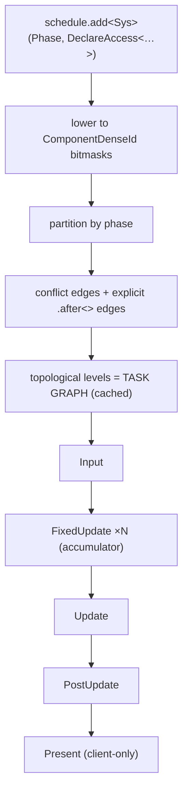

# Task Graph — Execution Flow

> Living design doc. **Status: draft** — not yet accepted.
> **ADR = the decision; this doc = the _how_.** Decisions live in
> [[ADR-007 — v2 networking & ECS replication foundation]] §6 — this is the **execution
> view** (one end-to-end sequence), not a restatement of the rules.

**Module:** `core` · **Kind:** system · **Status:** draft
**ADRs:** [[ADR-006 — v2 core architecture & module layout]] §5 ·
[[ADR-007 — v2 networking & ECS replication foundation]] §6 ·
[[ADR-010 — User authoring model (Systems & Scripts)]] *(Proposed)*
**Backlog:** [[Backlog]] → `core` → `systems` → Job-system / task-graph

> ⚠️ **Vocabulary:** this doc uses **`Scene`** (runtime ECS container) and **task graph**.
> ADR-006 §2/§5 and ADR-007 §6 still say `World` / "plan" / "scheduler" — a dated
> positioning amendment to both is **outstanding**.

## Purpose

How a registered system becomes running work. Three layers people conflate:

| Layer | What it is |
|---|---|
| **`Schedule`** | the **input data** — mutable entries (phase, enabled, access) |
| **Task graph** | the **derived structure** — built once from the schedule; systems = nodes, conflict/order edges = task edges |
| **Executor** | the **runner** — walks the prebuilt graph each frame |

`Schedule` = what you registered · task graph = what got compiled from it · executor = what runs it.

## Design

### Stage 1 — Compose time (once, `app` composition root)

```cpp
schedule.add<MovementSystem>(Phase::FixedUpdate,
                             DeclareAccess<Write<Transform>, Read<Velocity>>);
```

- Access covers **components *and* resources**.
- Lowered to **`ComponentDenseId` bitmasks** at registration → cheap set ops later.
- Engine defaults are ordinary entries — no privileged path; disable/replace = a list edit.
- `.after<A>()` escape hatch for semantic order with **no** data conflict (pairwise only).

### Stage 2 — Build the task graph (once, **on schedule mutation**)

1. Partition entries **by phase** (a system is in exactly one).
2. Within a phase: `conflict(A,B) ⇔ A.writes ∩ B.touches ≠ ∅` — w∩w, w∩r, r∩w.
   **r∩r ⇒ parallel.**
3. Conflict ⇒ deterministic serializing edge; plus explicit `.after<>` edges.
4. Topological sort → **levels**. That cached structure **is** the task graph.

**Built once, not per frame** — no per-frame allocation or string work (the F19 fix).

### Stage 3 — Per frame (executor walks the prebuilt graph)



- **Within a phase** — walk levels top-down. Same-level systems have disjoint writes →
  safely parallel (today level-by-level; later fed to the job pool **unchanged**).
  Systems do **value read/write only** here.
- **At each phase barrier** — the command buffer is applied **single-threaded, in
  deterministic order**; `NetId`s assigned. All structural change (spawn/despawn/
  add/remove) lands here. Determinism-under-parallelism holds by construction.
- **Debug safety net:** `Scene` asserts **`actual ⊆ declared`** — touching an undeclared
  component fires `TE_ASSERT`. Compiled out in release.

### Where scripts slot in (ADR-010, Proposed)

`ScriptSystem` is an ordinary entry pinned to the **terminal slot** of `FixedUpdate` and
`Update`:

```
[ level 0 ‖ level 1 ‖ … ]  →  [ ScriptSystem: all scripts ]  →  ‖ barrier: apply command buffer ‖
```

Scripts run after every system in the phase; their spawns queue into the **same** command
buffer — no separate path.

## Open questions (→ ADR)

- **Terminal slot** — ADR-010 §4 needs it; `.after<A>()` is pairwise and can't express
  "after everything". Mechanism undecided → task-graph ADR.
- **Executor threading** — level-by-level today; work-stealing pool + Jolt's internal
  pool integration deferred (fixes F15) → task-graph ADR.
- **Level granularity** — whole-system nodes only, or intra-system chunking for wide
  parallel iteration?
- **Schedule mutation at runtime** — rebuild cost + when a rebuild is legal (mid-frame?).

## References

- [[ADR-007 — v2 networking & ECS replication foundation]] §6 — the decisions
- [[ADR-006 — v2 core architecture & module layout]] §5 — System/helper taxonomy
- [[ADR-010 — User authoring model (Systems & Scripts)]] — script terminal slot
- [[v1 Code Audit]] — F15 (3 ad-hoc threading models), F19 (per-frame alloc)
- Code: *(none yet — `core` is greenfield)*
