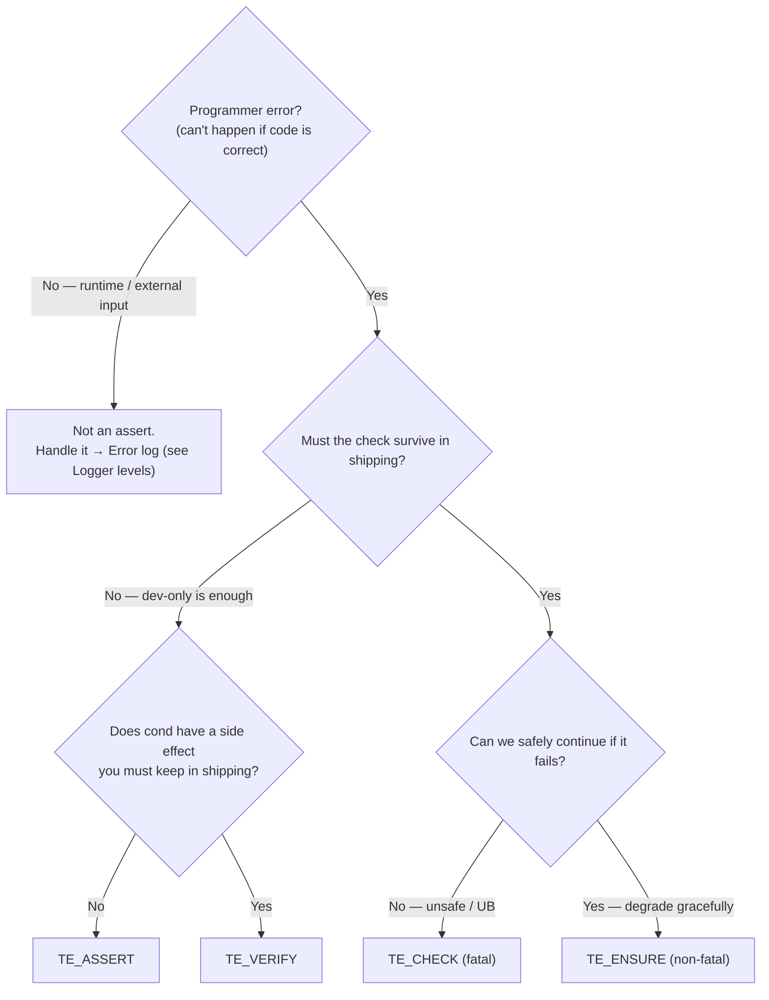
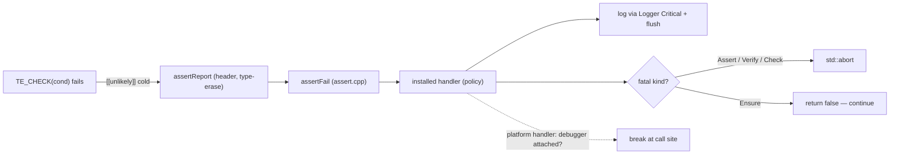

# Assert — Design

> Living design doc. Terse (CLAUDE.md token economy). ADR = the irreversible decision; this doc = the _how_.

**Module:** `base` (helper/utility — dependency-free leaf) · **Kind:** utility · **Status:** ⚠️ **draft — not committed; pending Sprint 02 Diagnostics ADR**
**ADRs:** [[ADR-006 — v2 core architecture & module layout]] §6 (two-tier seed), [[ADR-005 — v2 tech stack & toolchain]] · combined **Diagnostics (logging + assert)** ADR with [[Logger — Design]] · **Backlog:** [[Backlog]] → base → utilities

## Purpose
One assert strategy for the whole engine — fixes v1 **F10** (scattered `assert`/`cout`, no strategy,
silent `__debugbreak` in release). Paired with the Logger as the single "diagnostics" strategy
(ADR-005/006). **No external lib** — pure macros + `std::source_location` + compiler intrinsics;
depends only on the Logger (fail → log) and a thin platform hook (debugger-awareness).

## Decided
- **Four tiers** (below) + **one hookable handler**.
- Fail (fatal tiers): log (Critical) → flush → controlled abort. **Never a silent `__debugbreak` in
  release** (F10).
- Failure branch `[[unlikely]]` / cold; the happy path pays nothing.
- Handler is **installable** — tests swap a throw/flag policy (ADR-008 core tests); platform/app swap a
  debugger-aware one.
- Shares the Logger's `fmt` seam for formatted messages; positional `{0}` args.
- **Combined Diagnostics ADR** with the Logger (one strategy, shared seam + fail→log path).

## Tiers & usage rules
Two axes: **(1)** is `cond` evaluated in shipping? · **(2)** does failure abort in shipping?

| Macro | Eval (ship) | Abort (ship) | Use when… | Example |
|---|---|---|---|---|
| `TE_ASSERT` | ❌ | ❌ | dev-only correctness check, droppable, hot path — "can't happen if the code is correct" | internal index in bounds; non-null internal ptr; enum in range |
| `TE_VERIFY` | ✅ | ❌ (dev-only abort) | like ASSERT but `cond` has a **side effect to keep**, or you branch on the result | `if (!TE_VERIFY(stream.write(x))) return;` |
| `TE_CHECK` | ✅ | ✅ **fatal** | continuing is unsafe / UB in **any** build | allocator intact; GPU device created before use; required config present |
| `TE_ENSURE` | ✅ | ❌ **non-fatal** — log + continue, **report-once**; returns `bool` | recoverable-but-wrong; degrade gracefully | missing asset → placeholder; odd-but-handleable packet; soft budget exceeded |

### Which tier? (decision flow)

**Rules of thumb**
- **Start at "is this a programmer error?"** If it's runtime/external (bad file, dropped packet, user
  input) it's **never** an assert — log it / handle it. ASSERT tiers are for *"this is impossible if my
  code is correct."*
- **ASSERT vs CHECK** = "droppable in shipping?" · **CHECK vs ENSURE** = "can we safely continue?" ·
  **ASSERT vs VERIFY** = "does the condition have a side effect I must keep?"
- **Never put a side effect in `TE_ASSERT`** — it vanishes in shipping. That's what `TE_VERIFY` is for.
- **Prefer `ENSURE` over `CHECK` for anything survivable** — a hard abort in a player's session is a last
  resort; reserve `CHECK` for genuinely unrecoverable state (corrupt allocator, device lost).
- **Assert/Check ≠ Error log.** Assert = "impossible, programmer bug"; Error = "world did something bad,
  handled" (see [[Logger — Design]] level rules). *(These rules may promote to root `CONVENTIONS.md` when
  B4 lands.)*

## Design

### Macro → handler (mirrors the Logger seam)
Header exposes the macros + a tiny template that type-erases the message args → non-template
`assertFail(...)` in `assert.cpp`, which calls the **installed handler**; the handler decides
log / abort / break.

### Config mapping
| Build | ASSERT | VERIFY | CHECK | ENSURE |
|---|---|---|---|---|
| Debug | on | on | on | on |
| RelWithDebInfo (dev runtime) | on* | on | on | on |
| Release / Shipping | **off** (cond not eval) | cond eval, no abort | on (fatal) | on (non-fatal) |

\*RelWithDebInfo ASSERT on/off = open Q.

### `base` stays a leaf (the debugger-break subtlety)
`__debugbreak()` / `__builtin_trap()` are **compiler intrinsics** (no OS) → fine in `base`. But
"is a debugger attached?" (`IsDebuggerPresent`) is an **OS** call → *not* allowed in `base`. Resolution:
`base` ships the **default handler** (log + abort, no break); **platform/app install** the debugger-aware
handler through the hookable seam — the *same* seam the tests use. → no OS in `base`, DAG intact.

## Open questions (→ Diagnostics ADR)
- ⚠️ **Supersede ADR-006 §6 explicitly.** The four-tier model *changes* an Accepted
  decision — §6 says two-tier with `TE_VERIFY` "always-on for shipped invariants";
  here VERIFY = always-eval, **dev-only abort**. The Diagnostics ADR must state it
  supersedes ADR-006 §6's assert bullet (not silently drift past it).
- **SDK exposure** — do user scripts get assert macros (likely `ENSURE`/`CHECK`), and
  through what `te_sdk` seam? Ties to the base-ABI rules ([[ADR-010 — User authoring model (Systems & Scripts)]] §8).
- RelWithDebInfo: ASSERT on or off?
- ENSURE report-once scope — per call-site (static local) vs a global rate-limit.
- `TE_ASSUME(cond)` (C++23 `[[assume]]` / `__assume`) as a **separate** opt-in optimizer hint — in or
  out? (a wrong `assume` is UB, so never auto-derived from a compiled-out ASSERT.)
- Exact handler signature + install mechanism (runtime `setAssertHandler` vs link-time).
- **Bootstrap / recursion:** assert fires before the Logger is initialized (early boot) → **stderr
  fallback**; and the Logger's own hot path must not use an assert that routes back through the Logger
  (**no-recursion guard**). Pins the Assert→Logger dependency direction.

## References
- [[ADR-006 — v2 core architecture & module layout]] §6, [[ADR-005 — v2 tech stack & toolchain]]
- [[Logger — Design]] — shares the `fmt` seam + fail→log path; **combined Diagnostics ADR**
- [[v1 Code Audit]] — F10
- [[Backlog]] → base → utilities
