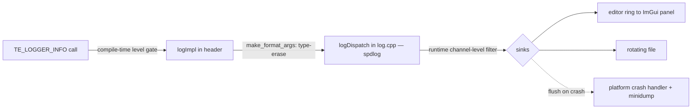

# Logger — Design

> Living design doc. Terse (CLAUDE.md token economy). ADR = the irreversible decision; this doc = the _how_.

**Module:** `base` (helper/utility — dependency-free leaf) · **Kind:** utility · **Status:** ⚠️ **draft — not committed; pending Sprint 02 ADRs**
**ADRs:** [[ADR-005 — v2 tech stack & toolchain]] (spdlog), [[ADR-006 — v2 core architecture & module layout]] §5/§6 · **Backlog:** [[Backlog]] → base → utilities

## Purpose
Structured, low-overhead logging for the whole engine, wrapping **spdlog** (don't rebuild infra).
Fixes v1: **F20** (no call-site info), **F10** (no log/assert strategy), **F16** (logger was a System),
**F4** (duplicated logger globals — gone under v2 static-link-once).

## Decided
- Wrap **spdlog**; **fmt** for formatting (ADR-005).
- Macros capture `std::source_location::current()` → file/func/line free (F20).
- Every macro `do{…}while(0)` (F10 if/else break).
- helper(**utility**): global macros/free fns, safe under static linkage (ADR-006 §5).
- **Math formatters live with math**, not here — logger stays a leaf (§6).
- Per-level macros `TE_LOGGER_TRACE/DEBUG/INFO/WARN/ERROR/CRITICAL`.
- fmt **positional args** `{0} {1}` (reorder/reuse; never mix with bare `{}`).

## Design

### The seam — `fmt` in header, spdlog in one `.cpp`
Public `base/log.hpp` exposes the macros, `Level`, `LogChannel`, and **fmt** — *not* spdlog. The
call site type-erases args into `fmt::format_args`; a **non-template** `logDispatch(...)` (defined in
`log.cpp`, the only TU that sees spdlog) formats + routes. → fast compiles everywhere, spdlog
swappable, compile-time-checked format strings.

### Channels — self-registering (keeps `base` a leaf)
base owns the *mechanism*, not the channel list (a base enum of `render`/`net`/… would couple the leaf
upward — F3/F12). Each module registers its own:
`registerChannel("render", Module::Client, Level::Info)` → `LogChannel` handle (small int). No per-call
string hashing; per-channel **runtime** level = array index. The **module tag** gives two-level editor
filtering (module → channel).

### Structured record — why editor filtering stays clean
Editor sink stores **records**, not strings — filter on fields, never re-parse:
`{ time, frame#, level, channel(+module), file, function, line, message }`.
File/console sinks flatten a record to a line; the editor keeps the struct.

### Sinks
- **editor-console** — lock-free ring → ImGui Log panel (twin of the [[Backlog|Profiler]] panel).
- **rotating file** — `logs/…`, size/count capped (async: open Q).
- **flush-on-crash hook** — crash handler + minidump live in `platform`, **not** a sink (ADR-008
  symbolicated dumps). Logger retains an in-memory ring of last N; on crash → flush + attach.

### Format (rendered — file/console)
`[14:32:07.412][f 1043][client · render][renderer.cpp:88 renderScene][INFO] swapchain 1920x1080`
Timestamp = wall-clock **+ engine frame #** (frame # correlates logs ↔ a Profiler capture of the same
frame; frame # from the base Clock).

## Level usage rules
Rule of thumb: **level = who needs it + can it ship + how often it fires.** Fires every frame ⇒
Trace/Debug, never Info+.

| Level | Use for | Freq | Shipping |
|---|---|---|---|
| **Trace** | per-frame / per-entity spam | very high | compiled out |
| **Debug** | dev diagnostics while building a system | high | compiled out |
| **Info** | lifecycle / state events (window created, level loaded, connected) | low | dev runtime |
| **Warn** | unexpected but *handled*; engine continued (missing texture → fallback, over-budget frame) | low | **kept** |
| **Error** | operation *failed*, subsystem degraded, process survives (shader compile fail, corrupt asset) | rare | **kept** |
| **Critical** | unrecoverable, about to abort / data loss (device lost, OOM) | very rare | **kept** → crash flush |

**Error/Critical ≠ assert.** Assert = "this is impossible, programmer bug" (`TE_ASSERT`/`TE_CHECK`,
ADR-006 §6); Error = "the world did something bad and we handled it." Missing file → Error; null where
null is impossible → assert. *(These rules may promote to root `CONVENTIONS.md` when B4 lands.)*

## Open questions (→ Logger ADR)
- **SDK exposure** — user scripts will log ([[ADR-010 — User authoring model (Systems & Scripts)]]):
  which macros cross `te_sdk`, and under what ABI rules (no STL by value across the DLL seam)?
- Exact seam surface — how much `fmt` leaks vs fully hidden.
- Async vs sync file sink (cross-thread ordering trade).
- Shipping compile-time min level per build config.
- Channel/module id scheme — enum vs a registry range reserved for user/game channels.

## References
- [[ADR-005 — v2 tech stack & toolchain]], [[ADR-006 — v2 core architecture & module layout]] §5/§6
- [[v1 Code Audit]] — F20, F10, F16, F4
- [[Backlog]] → base → utilities (Profiler is the sibling — shares the editor-panel + frame-# pattern)
