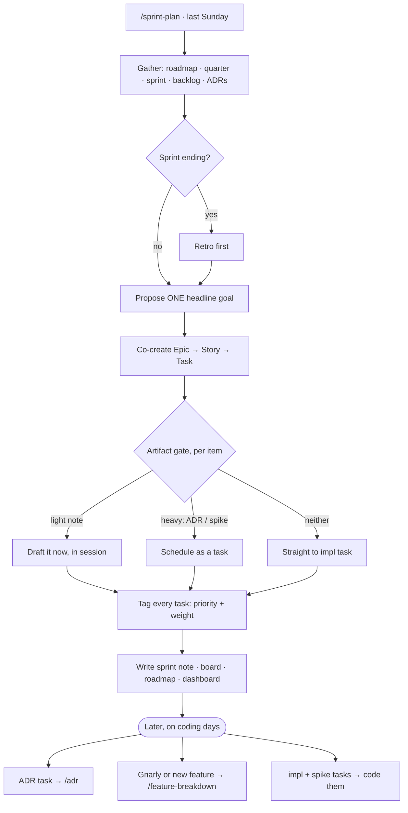

# 🚦 Planning Workflow — Artifact Gate

How a backlog item earns paperwork **and how its tasks get sized**. Read at
**grooming** and **sprint planning**. Owns the "does this need an ADR / design note?"
decision, *when* that artifact gets made, and the **priority + weight** every task
carries. Deliberate choices, not reflexes. Wired into `/feature-breakdown` + `/sprint-plan`.

**Dual purpose — human *and* Claude read these.** The artifact isn't just planning
paperwork; it's the **spec Claude consults before advising mid-implementation** so it
anchors to the intended end-state instead of improvising (CLAUDE.md rule 2). That's the
real cost/benefit of the gate: an artifact chosen here = grounded answers later; an
artifact skipped where one was warranted = Claude guessing the goal on the spot. Pick
deliberately with *both* readers in mind.

## The trap this prevents

There is **no** fixed pipeline `backlog → ADR → design doc → impl → docs`. Treating
those as five stages every item marches through is the overkill. They're a **menu**,
picked per item by **reversibility × blast radius**. Most items pick "none" or "one".

## Two axes — don't merge them

- **Breakdown:** Epic → Story → Task, session-sized (2–6h, explicit done-condition).
- **Artifacts:** ADR / design note / docs — the paperwork a task needs.

The artifacts **are tasks** on the breakdown tree ("write Diagnostics ADR" is a task),
not a parallel process. Type the task, then apply the gate below.

## The gate

For each item, ask: *is there a decision, how reversible, how wide?*

| Item smell | ADR? | Design note? | Then |
|---|---|---|---|
| Hard-to-reverse **and** cross-module | ✅ | maybe | ADR task precedes impl task |
| Load-bearing but cohesive | ✅ (combine related) | fold into ADR | one ADR, no separate note |
| Non-trivial shape, decision settled, one module | ❌ | ✅ | design note → impl |
| Reversible / local / obvious | ❌ | ❌ | straight to impl task |

Bottom row is the default. Forcing an ADR there is the drift.

## ADR **or** design note — rarely both

An ADR's *Decision + Consequences* already **is** the design. Split into a separate
[[Design Doc Template|design note]] only when:

- the ADR would **balloon** past its job (decision + rationale) → peel detail out, **or**
- the shape will **churn during implementation** → ADRs are immutable (write a
  superseding one to change), design notes are living.

So the only legitimate split: **ADR = frozen decision + why · design note = mutable
working shape.** If a mid-tier item sprouts two *decision* artifacts, that's the alarm.

**But: once a system enters implementation, a design note becomes the default — as the
hub, not a second decision home.** The rule above governs where decisions get *authored*;
recall is different. Mid-implementation questions need **one entry point per system**,
not a hunt across ADRs. So the note's **Decided** section (already in
[[Design Doc Template]]) indexes: **one-line decision statements + ADR/§ refs — never
copied rationale** (one home per fact, or the copies drift). Lookup flow: **design note
first; follow the ADR link only for the why.** [[Task Graph — Execution Flow]] is the
reference example.

## Artifact timing — light drafts *in* planning, heavy is a task

When the gate says an item needs an artifact but none exists, decide **when** it's made:

| Decision weight | When | Becomes |
|---|---|---|
| **Light** — short note, call is essentially clear, no spike/research | **drafted in the Sunday planning session** | part of the ceremony, *not* a sprint task |
| **Heavy** — an ADR, or a note gated on a spike/research | a **task in the sprint** | Deep/Moderate weight, ordered *before* the impl task it unblocks |

At planning, **flag every artifact-less item the gate wants an artifact for** — draft the
light ones on the spot, schedule the heavy ones. Never let implementation start
artifact-less on an item that warranted one (CLAUDE.md rule 2).

## "Documentation" is not a stage

It's a **DoD checkbox** — capture the retro, touch the affected system doc in place.
No separate task, no pipeline stage. Update in place, prune stale (vault hygiene).

## Task attributes — priority + weight

Every task carries **both**, so the pick matches the day (not just the sprint).

**Priority** — value to the sprint goal:

- **P1** — critical path / goal-blocking · **P2** — important, wanted this sprint ·
  **P3** — opportunistic / nice-to-have

**Weight** — energy it needs = which day-type it fits (the [[Dashboard]] cadence):

- 🟢 **Deep** — hard design / long focus → Mon/Thu/Sun
- 🟠 **Moderate** — solid but bounded → Fri
- 🟡 **Light** — small, low cognitive load (docs, config, mechanical) → Tue/Wed

**Pick rule:** weight fits the day *first* — never a 🟢 Deep task on a light Tue — then
highest **priority** among what fits. Tag format on every task line: `· P1 · 🟢 Deep`.

## Lean model this collapses to

1. **Backlog entry** — always, cheap.
2. **One decision artifact** — ADR *or* design note, rarely both (gate above). Often none.
   Light → drafted in planning; heavy → a sprint task.
3. **Implementation** — always, Miguel writes it.
4. **Docs** — DoD line, not a stage.

Every task in 2–3 carries **priority + weight** (`· P1 · 🟢 Deep`).

## Running a planning session

`/sprint-plan` is the umbrella ceremony — it **contains** the breakdown + the gate.
The other commands are **triggered out of it**, not run in sequence after it.

**Which command when:**

| Situation | Command | Timing |
|---|---|---|
| Gate flagged an **ADR** (always heavy → its own task) | `/adr <decision>` | later, a **deep/moderate day** — *not* in the ceremony |
| A **light design note** | *(none — Design Doc template)* | drafted **with Claude during planning** |
| A **spike** task | *(just code it)* | its scheduled day; feeds the artifact after |
| A story **too big to decompose** in the ceremony | `/feature-breakdown <feature>` | a dedicated pass, or pre-groom the week before |
| A **new feature appears mid-sprint** | `/feature-breakdown` | decompose in isolation; park tasks in backlog |

**Mental model:** `/sprint-plan` = the whole board · `/feature-breakdown` = zoom into one
card · `/adr` = execute one decision the gate demanded.
