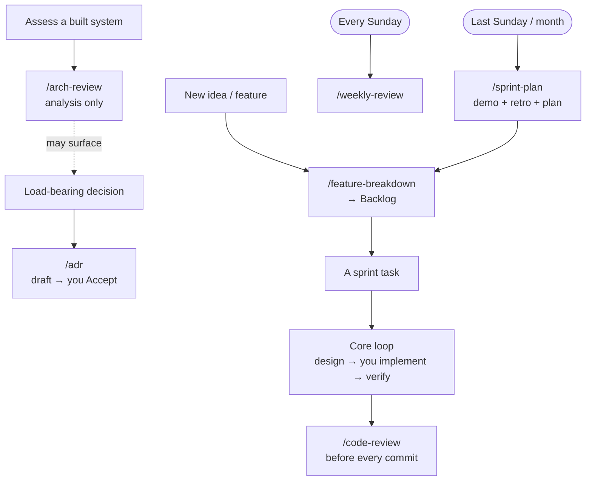

# 🤝 Working with Claude — Operating Guide

How to get high-quality, high-performance engine work out of Claude Code without
burning out. This is the *human* playbook; the machine-facing rules live in the
repo-root `CLAUDE.md` (auto-loaded every session), and the role is defined in
[[Technical Lead Charter]].

---

## Division of labor

**You are the principal driver and programmer.** You write the engine — for
mastery and ownership. Claude is your **technical lead + pair, not your
implementer**:

- Design & architecture, trade-offs, decomposition, research, ADRs.
- Boilerplate & scaffolding *on request* (headers, glue, build/test scaffolds).
- Review of code you wrote, and answers when you're stuck.
- **Scrum master on process**: co-creates the sprint plan (epics → tasks) *with* you as
  an equal driver, runs the ceremonies — see [[Technical Lead Charter]].

Rule of thumb: bring Claude **decisions, designs, and finished code to review** —
not "build this feature for me."

## The core loop (every non-trivial task)

> **Design (with Claude) → You implement → Claude reviews → iterate**

1. **Design** — discuss the approach with Claude first (plan mode is great here).
   Make it argue the trade-offs. Agree on the design before you write. This is
   where most mistakes die, cheaply.
2. **Scaffold (optional)** — ask Claude for boilerplate/skeletons if it saves
   time. You own the logic that goes inside them.
3. **Implement** — *you* write it. One task at a time.
4. **Verify** — it must build; run the editor/demo if rendering changed. "Done"
   requires evidence.
5. **Review** — hand the diff to Claude (`/code-review`, or `/code-review ultra`
   for big/risky changes) before you commit. Nothing lands on the main branch
   directly.

## Session types → commands

The **weekly rhythm** (which day is deep/light/relaxed/off) lives on the [[Dashboard]] —
follow that calendar. Match the session type to the day's mode:

| Mode | Session type | Commands |
|------|--------------|----------|
| Deep | Implementation | core loop; `/code-review` before commit |
| Moderate | Lighter implementation — finish/refactor, wrap up | core loop (shorter) |
| Light | Read code/docs, small fixes, ADR drafting | `/arch-review`, `/adr` |
| Relaxed | Optional light planning / docs, or rest | — |
| Off | No engine work | — |

Ceremonies: **Sundays** `/weekly-review`; **last Sunday of the month** `/sprint-plan`
(demo + retro + next-sprint planning).

## One task per session

Start focused, finish, `/clear`, next. When a new idea appears mid-task, it goes
to [[Backlog]] — not into the current diff. Long, wandering sessions are where
context rot and sloppy changes come from.

## Writing style (notes)

Keep vault notes token-lean — read by you AND Claude every session. Tables/bullets
over prose, caveman style OK, one topic per note, link don't duplicate. Full rule:
repo-root `CLAUDE.md` → "Token economy & vault cleanliness".

## Slash commands (in `.claude/commands/`)

| Command                        | Use it for                                                |
| ------------------------------ | --------------------------------------------------------- |
| `/weekly-review [notes]`       | Sunday review → writes the journal + updates dashboard    |
| `/sprint-plan [focus]`         | Monthly planning → retro + next sprint, sized to capacity |
| `/adr <decision>`              | Draft an ADR for a load-bearing decision                  |
| `/arch-review <area>`          | Technical-lead review of a system (analysis, no edits)    |
| `/feature-breakdown <feature>` | Epic → Story → session-sized Tasks                        |
| `/vault-clean [folder]`        | Sweep the vault for stale / redundant / malformed / orphaned content and tidy it |

Built-in ones worth habituating: **plan mode** for design, **`/code-review`**
before commits, **`/clear`** between tasks.

### When to reach for which

- **Cadence commands fire on the calendar:** `/weekly-review` every Sunday;
  `/sprint-plan` the last Sunday of the month (which then feeds `/feature-breakdown`).
- **Work commands fire on a trigger, not the clock:** a load-bearing decision → `/adr`;
  decomposing a feature → `/feature-breakdown`; assessing existing code → `/arch-review`;
  before any commit → `/code-review`.
- **Agents support these, they don't replace them:** `/adr` can lean on
  `adr-consistency-checker`; research / prior-art during design → `engine-researcher` /
  `v1-reference-miner`.
- **Maintenance chore:** `/vault-clean` on a light/relaxed day (or at a sprint boundary)
  keeps the vault current and lean.

## Subagents (in `.claude/agents/`)

Delegated helpers Claude spins up for isolated / fan-out work — they keep heavy
searching and research out of the main design context. Ask for one by name, or let
Claude route to it. All are **read-only or research** — they report, they don't edit.

| Agent | Use it for |
|-------|-----------|
| `v1-reference-miner` | "How did v1 do X?" / the `file:line` behind an audit finding (F1–F35) — mines the frozen `v1-reference` tag |
| `engine-researcher` | Evaluate a technique/paper/library in any sub-area (rendering, physics, netcode, ECS, audio, serialization, tooling) → cost + concrete TechEngine decisions (web) |
| `adr-consistency-checker` | Check a proposal against the **accepted** ADRs before you build on it |

---

## The five mistakes this setup is designed to prevent

1. **Accepting code you don't understand.** Rule: if you'd keep it, you must be
   able to explain it. Ask Claude to walk you through anything non-obvious.
   Small diffs make this possible.
2. **Silent rewrites.** Claude is instructed to bias toward refactor and to
   demand evidence before a rewrite. Hold it to that (see [[Principles]] #2).
3. **Context rot.** Long sessions degrade quality. One task, then `/clear`.
4. **Skipping verification.** "It builds / it doesn't" is stated every time.
   Rendering changes get a visual check, not a claim.
5. **Scope creep & burnout.** Capacity is finite. Claude is told your schedule
   and to flag when a session runs long or scope balloons — let it.

## Using Claude as technical lead, not typist

- Bring it **decisions and designs**, not just "write X." The leverage is in
  architecture and trade-offs (see [[Prompt Library]]).
- Make it **argue against your idea** before you commit to it.
- Everything load-bearing ends in an **ADR** you deliberately Accept.

## Quality & performance stance

- Correctness → clarity → performance, in that order.
- No optimization without a measurement. Land profiling hooks before big perf work.
- Deterministic core systems (ECS, resources, serialization, math) get **unit
  tests**; rendering gets **demo + before/after captures**. (There are no tests
  yet — closing this gap is real engine work, not overhead.)

---

_Related: [[Technical Lead Charter]] · [[Prompt Library]] · repo-root `CLAUDE.md`_
